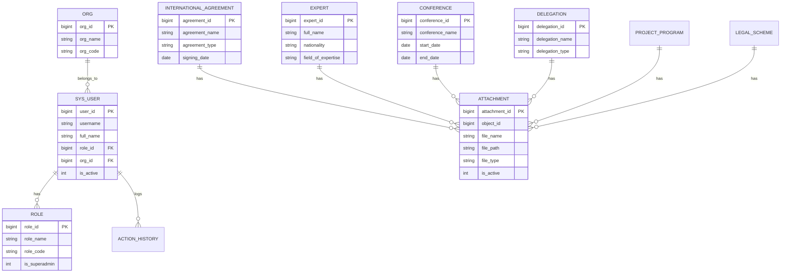

# Sơ Đồ Thực Thể Liên Kết (ERD — Entity Relationship Diagram)

```mermaid
erDiagram
    SYS_USER ||--o{ ROLE : "has"
    SYS_USER ||--o{ ACTION_HISTORY : "logs"
    ORG ||--o{ SYS_USER : "belongs_to"
    INTERNATIONAL_AGREEMENT ||--o{ ATTACHMENT : "has"
    EXPERT ||--o{ ATTACHMENT : "has"
    CONFERENCE ||--o{ ATTACHMENT : "has"
    DELEGATION ||--o{ ATTACHMENT : "has"
    PROJECT_PROGRAM ||--o{ ATTACHMENT : "has"
    LEGAL_SCHEME ||--o{ ATTACHMENT : "has"

    SYS_USER {
        bigint user_id PK
        string username
        string full_name
        bigint role_id FK
        bigint org_id FK
        int is_active
    }
    ROLE {
        bigint role_id PK
        string role_name
        string role_code
        int is_superadmin
    }
    ORG {
        bigint org_id PK
        string org_name
        string org_code
    }
    INTERNATIONAL_AGREEMENT {
        bigint agreement_id PK
        string agreement_name
        string agreement_type
        date signing_date
    }
    EXPERT {
        bigint expert_id PK
        string full_name
        string nationality
        string field_of_expertise
    }
    CONFERENCE {
        bigint conference_id PK
        string conference_name
        date start_date
        date end_date
    }
    DELEGATION {
        bigint delegation_id PK
        string delegation_name
        string delegation_type
    }
    ATTACHMENT {
        bigint attachment_id PK
        bigint object_id
        string file_name
        string file_path
        string file_type
        int is_active
    }
```
